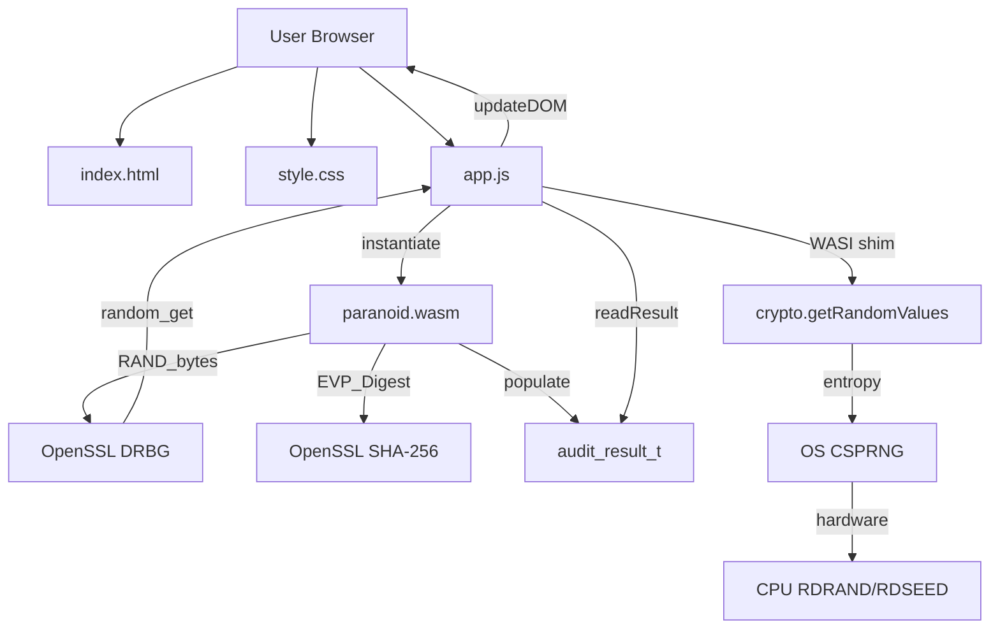
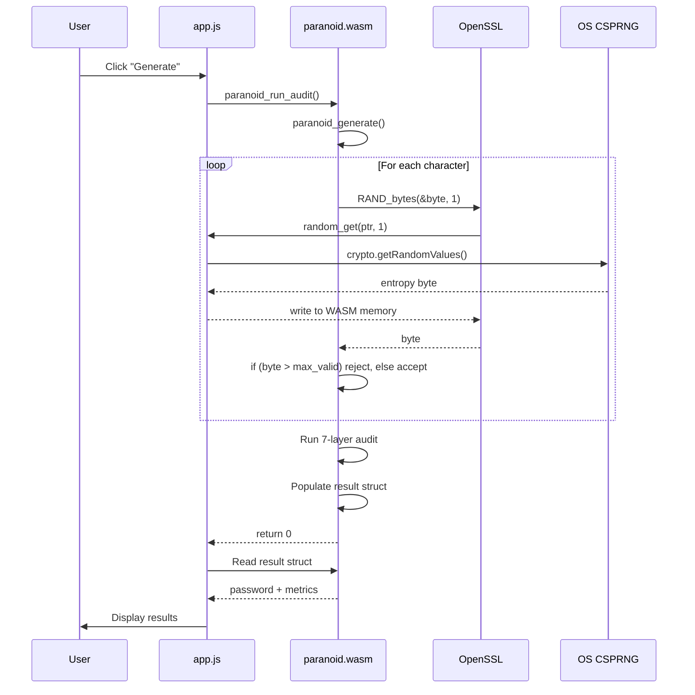

# Architecture

This document describes the system architecture of `paranoid` v3.0, a self-auditing
cryptographic password generator built with WebAssembly.

**v3.0 changes**: Platform abstraction layer replaces direct OpenSSL calls in
WASM. Native builds use OpenSSL; WASM builds use compact SHA-256 + WASI
random_get. Binary size reduced from ~180KB to <100KB. CMake replaces Makefile.
New API: multi-password, charset validation, constrained generation, compliance.

---

## Table of Contents

- [High-Level Overview](#high-level-overview)
- [Component Architecture](#component-architecture)
- [Data Flow](#data-flow)
- [Memory Model](#memory-model)
- [Trust Boundaries](#trust-boundaries)
- [Deployment Architecture](#deployment-architecture)

---

## High-Level Overview

```
┌─────────────────────────────────────────────────────────────────┐
│                        USER BROWSER                              │
│                                                                  │
│  ┌──────────────────────────────────────────────────────────┐   │
│  │                    PRESENTATION LAYER                     │   │
│  │                                                           │   │
│  │  ┌────────────┐  ┌───────────┐  ┌──────────────────┐    │   │
│  │  │ index.html │  │ style.css │  │  app.js (BRIDGE) │    │   │
│  │  │ Structure  │  │  Visuals  │  │  - loadWasm()    │    │   │
│  │  │  Only      │  │   Only    │  │  - readResult()  │    │   │
│  │  └────────────┘  └───────────┘  │  - launchAudit() │    │   │
│  │                                  │  - WASI shim (3L)│    │   │
│  │                                  └──────────────────┘    │   │
│  └────────────────────┬─────────────────────────────────────┘   │
│                       │                                          │
│                       │ WebAssembly.instantiate()                │
│                       │ + WASI polyfill                          │
│                       ▼                                          │
│  ┌──────────────────────────────────────────────────────────┐   │
│  │                  COMPUTATION LAYER                        │   │
│  │                   (WASM SANDBOX)                          │   │
│  │                                                           │   │
│  │  ┌─────────────────────────────────────────────────────┐ │   │
│  │  │         paranoid.wasm (<100KB)                      │ │   │
│  │  │                                                     │ │   │
│  │  │  WASM LINEAR MEMORY (opaque to JavaScript)         │ │   │
│  │  │  ┌────────────────────────────────────────────┐    │ │   │
│  │  │  │  paranoid_audit_result_t (484 bytes)       │    │ │   │
│  │  │  │  - password[257]                           │    │ │   │
│  │  │  │  - chi2_statistic (double)                 │    │ │   │
│  │  │  │  - total_entropy (double)                  │    │ │   │
│  │  │  │  - all_pass (int)                          │    │ │   │
│  │  │  │  - current_stage (int)                     │    │ │   │
│  │  │  │  ... 30 fields total                       │    │ │   │
│  │  │  └────────────────────────────────────────────┘    │ │   │
│  │  │                                                     │ │   │
│  │  │  C FUNCTIONS (src/paranoid.c):                     │ │   │
│  │  │  - paranoid_run_audit()      [Main orchestrator]   │ │   │
│  │  │  - paranoid_generate()       [CSPRNG + rejection]  │ │   │
│  │  │  - paranoid_chi_squared()    [Statistical test]    │ │   │
│  │  │  - paranoid_sha256()         [Cryptographic hash]  │ │   │
│  │  │  ... 15+ exported functions                        │ │   │
│  │  │                                                     │ │   │
│  │  │  PLATFORM ABSTRACTION (paranoid_platform.h):        │ │   │
│  │  │  Native: OpenSSL RAND_bytes + EVP SHA-256          │ │   │
│  │  │  WASM:   WASI random_get + compact SHA-256         │ │   │
│  │  │          (FIPS 180-4, <100KB, no OpenSSL)          │ │   │
│  │  └─────────────────────────────────────────────────┘ │   │
│  └────────────────────┬──────────────────────────────────┘   │
│                       │                                        │
│                       │ WASI syscall: random_get(ptr, len)     │
│                       ▼                                        │
│  ┌──────────────────────────────────────────────────────────┐ │
│  │              ENTROPY SOURCE LAYER                        │ │
│  │                                                          │ │
│  │  crypto.getRandomValues(buf)  ← OS CSPRNG               │ │
│  │  - /dev/urandom (Linux/macOS)                           │ │
│  │  - CryptGenRandom (Windows)                             │ │
│  │  - SecRandomCopyBytes (macOS)                           │ │
│  └──────────────────────────────────────────────────────────┘ │
└──────────────────────────────────────────────────────────────┘
```

---

## Component Architecture

### 1. Presentation Layer (Browser DOM)

**Components**:
- `www/index.html` — Semantic HTML structure
- `www/style.css` — Visual state management (CSS-only wizard navigation)
- `www/app.js` — WASM bridge (NO crypto logic)

**Responsibilities**:
- Render UI elements (inputs, buttons, result displays)
- Handle user interactions (button clicks, form submissions)
- Load and instantiate WASM module
- Read results from WASM linear memory
- Update DOM based on audit progress

**Does NOT**:
- Generate random bytes
- Perform statistical calculations
- Touch password data (except as opaque string from WASM)

---

### 2. Computation Layer (WASM Sandbox)

**Components**:
- `src/paranoid.c` -- All computation logic (uses platform abstraction)
- `include/paranoid.h` -- Public API definitions (v3.0)
- `include/paranoid_platform.h` -- Platform abstraction interface
- `src/platform_wasm.c` -- WASM backend (WASI random_get)
- `src/platform_native.c` -- Native backend (OpenSSL, for tests)
- `src/sha256_compact.c` -- FIPS 180-4 SHA-256 (WASM only)

**Responsibilities**:
- **Password generation**:
  - Call `paranoid_platform_random()` for entropy (WASI random_get in WASM)
  - Apply rejection sampling to eliminate modulo bias
  - Build password string from charset
  
- **Statistical audit** (7 layers):
  1. Chi-squared test (uniform distribution)
  2. Serial correlation (independence)
  3. Collision detection (uniqueness)
  4. Entropy proofs (NIST conformance)
  5. Birthday paradox (collision probability)
  6. Pattern detection (heuristics)
  7. NIST thresholds (AAL1/AAL2/AAL3)
  
- **Hash computation**:
  - SHA-256 via platform abstraction (OpenSSL EVP native, compact FIPS 180-4 WASM)
  - Used for collision detection (hash-compare)
  
- **Result struct**:
  - Populate `paranoid_audit_result_t` with all metrics
  - Expose pointer to JS via `paranoid_get_result_ptr()`

**Guarantees**:
- Cryptographically secure randomness (platform CSPRNG: OpenSSL native, WASI WASM)
- Uniform character distribution (rejection sampling)
- Deterministic struct layout (verified by JS at runtime)

---

### 3. Entropy Source Layer (OS CSPRNG)

**Components**:
- Browser `crypto.getRandomValues()` API
- OS kernel CSPRNGs:
  - Linux/macOS: `/dev/urandom`
  - Windows: `CryptGenRandom`
  - macOS: `SecRandomCopyBytes`

**Responsibilities**:
- Provide hardware-backed entropy
- Seed OpenSSL DRBG via WASI `random_get()` syscall

**Trust assumption**:
- OS CSPRNG is trusted
- Browser correctly implements Web Crypto API
- No active MitM on `crypto.getRandomValues()`

---

## Data Flow

### Password Generation Flow

```
1. USER INTERACTION
   User clicks "Generate + Run 7-Layer Audit"
   
   ↓
   
2. JAVASCRIPT BRIDGE (app.js)
   wasmExports.paranoid_run_audit(charset, charset_len, pw_length, batch_size, result_ptr)
   
   ↓
   
3. WASM ENTRY POINT (paranoid.c)
   int paranoid_run_audit(...) {
       // Stage 1: Generate password
       paranoid_generate(charset, charset_len, pw_length, result->password);
       
       ↓
       
4. PASSWORD GENERATION (paranoid.c)
   int paranoid_generate(...) {
       for (each char position) {
           int max_valid = (256 / N) * N - 1;
           
           do {
               RAND_bytes(&byte, 1);  ← ENTROPY REQUEST
           } while (byte > max_valid);
           
           output[i] = charset[byte % N];
       }
   }
   
   ↓
   
5. OPENSSL DRBG (libcrypto.a)
   RAND_bytes() → DRBG_generate() → WASI random_get()
   
   ↓
   
6. WASI SHIM (app.js, 3 lines)
   random_get(ptr, len) {
       crypto.getRandomValues(new Uint8Array(mem.buffer, ptr, len));
       return 0;
   }
   
   ↓
   
7. BROWSER WEB CRYPTO API
   crypto.getRandomValues() → OS CSPRNG → Hardware entropy
   
   ↓
   
8. ENTROPY FLOWS BACK UP
   Hardware → OS → Browser → WASI shim → WASM memory → OpenSSL → paranoid.c
   
   ↓
   
9. STATISTICAL AUDIT (paranoid.c)
   Generate 500 passwords for batch testing
   Run 7 statistical tests
   Populate result struct
   
   ↓
   
10. JAVASCRIPT READS RESULT (app.js)
    readResult() {
        const password = readCString(OFFSETS.PASSWORD);
        const chi2 = readF64(OFFSETS.CHI2_STATISTIC);
        const allPass = readI32(OFFSETS.ALL_PASS);
        // ... 30 fields total
    }
    
    ↓
    
11. DOM UPDATE
    Display password, show test results, update stage indicators
```

---

## Memory Model

### WASM Linear Memory Layout

```
Address         Content                          Size      Access
───────────────────────────────────────────────────────────────────
0x00000000      WASM runtime metadata            Variable  Internal
...
0x00001000      C heap (malloc/free)             Variable  C code only
...
0x00010000      paranoid_audit_result_t (static) 484 bytes C + JS (read-only)
                ├─ 0x00010000: password[257]     257 bytes
                ├─ 0x00010101: sha256_hex[65]    65 bytes
                ├─ 0x00010142: password_length   4 bytes (int)
                ├─ 0x00010146: (padding)         2 bytes
                ├─ 0x00010148: charset_size      4 bytes (int)
                ├─ 0x00010150: chi2_statistic    8 bytes (double)
                ├─ 0x00010158: chi2_df           4 bytes (int)
                ├─ 0x00010160: chi2_p_value      8 bytes (double)
                ├─ 0x00010168: chi2_pass         4 bytes (int)
                ├─ 0x00010170: serial_correlation 8 bytes (double)
                ├─ 0x00010178: serial_pass       4 bytes (int)
                ├─ 0x0001017C: batch_size        4 bytes (int)
                ├─ 0x00010180: duplicates        4 bytes (int)
                ├─ 0x00010184: collision_pass    4 bytes (int)
                ├─ 0x00010188: bits_per_char     8 bytes (double)
                ├─ 0x00010190: total_entropy     8 bytes (double)
                ├─ 0x00010198: log10_search_space 8 bytes (double)
                ├─ 0x000101A0: brute_force_years 8 bytes (double)
                ├─ 0x000101A8: nist_memorized    4 bytes (int)
                ├─ 0x000101AC: nist_high_value   4 bytes (int)
                ├─ 0x000101B0: nist_crypto_equiv 4 bytes (int)
                ├─ 0x000101B4: nist_post_quantum 4 bytes (int)
                ├─ 0x000101B8: collision_probability 8 bytes (double)
                ├─ 0x000101C0: passwords_for_50pct 8 bytes (double)
                ├─ 0x000101C8: rejection_max_valid 4 bytes (int)
                ├─ 0x000101D0: rejection_rate_pct 8 bytes (double)
                ├─ 0x000101D8: pattern_issues    4 bytes (int)
                ├─ 0x000101DC: all_pass          4 bytes (int)
                └─ 0x000101E0: current_stage     4 bytes (int)
...
0x00020000      OpenSSL DRBG state               Variable  OpenSSL only
...
0x00100000      Stack                            Variable  C code only
...
0x10000000      (End of addressable memory)
```

**Alignment rules**:
- `char` / `int8_t`: 1-byte alignment
- `int` / `int32_t`: 4-byte alignment
- `double` / `int64_t`: 8-byte alignment
- Compiler inserts padding for alignment

**JavaScript access**:
- Read-only access via `DataView` on `WebAssembly.Memory.buffer`
- Offset verification at init time (prevent misalignment bugs)
- Never writes to WASM memory (C code owns the struct)

---

## Trust Boundaries

### Primary Trust Boundary: WASI `random_get()`

```javascript
// THIS IS THE ONLY SECURITY-CRITICAL JAVASCRIPT
// Lines 15-17 of www/app.js

random_get(ptr, len) {
  crypto.getRandomValues(new Uint8Array(mem.buffer, ptr, len));
  return 0;
}
```

**Above this line**: WASM sandbox (C code)  
**Below this line**: OS kernel (hardware entropy)

**Threat model**:
- Attacker controlling browser environment could replace `crypto.getRandomValues()`
- SRI hashes mitigate CDN/proxy tampering
- Browser extensions (with content script permissions) could monkey-patch before load
- No practical defense against malicious browser extensions

---

### Secondary Trust Boundaries

1. **Build-time**: Zig compiler + OpenSSL library
   - Mitigated by: SHA-pinned GitHub Actions, reproducible builds (planned)

2. **Deploy-time**: GitHub Actions + GitHub Pages
   - Mitigated by: SHA-pinned actions, artifact attestation (planned)

3. **Load-time**: CDN/proxy serving HTML/JS/CSS/WASM
   - Mitigated by: SRI hashes on all assets

4. **Runtime**: JavaScript reading WASM memory
   - Mitigated by: Struct offset verification (runtime checks)

---

## Deployment Architecture

### Local Development

```
Developer Machine
    ├─ Edit src/paranoid.c, www/*.{html,css,js}
    ├─ Run: make clean && make site
    ├─ Run: make serve (Python HTTP server)
    └─ Test in browser: http://localhost:8080
```

### GitHub Actions CI/CD

```
GitHub Repository
    │
    ├─ Pull Request
    │   ▼
    │  ┌─────────────────────────────────────────────────────────┐
    │  │  ci.yml (Pull Requests)                                  │
    │  │  Docker Build → acutest C tests → E2E (Playwright)       │
    │  │  WASM Verification → All checks must pass to merge       │
    │  └─────────────────────────────────────────────────────────┘
    │
    ├─ Push to main
    │   ▼
    │  ┌─────────────────────────────────────────────────────────┐
    │  │  cd.yml (Push to Main)                                   │
    │  │  Docker Build → SBOM → Provenance → Cosign Sign          │
    │  │  release-please → Creates release PR when ready          │
    │  └─────────────────────────────────────────────────────────┘
    │
    ├─ Release Published
    │   ▼
    │  ┌─────────────────────────────────────────────────────────┐
    │  │  release.yml (Release Published)                         │
    │  │  Build from tag → Attest → Sign → Upload Assets          │
    │  │  Deploy to GitHub Pages from signed release              │
    │  └─────────────────────────────────────────────────────────┘
    │
    ▼
GitHub Pages
    └─ https://jbcom.github.io/paranoid-passwd
       ├─ index.html (with SRI hashes)
       ├─ paranoid.wasm
       ├─ app.js
       ├─ style.css
       └─ BUILD_MANIFEST.json
```

### Production Deployment

```
User Browser
    │
    ├─ Navigate to https://jbcom.github.io/paranoid-passwd
    │
    ▼
GitHub Pages CDN (Fastly)
    │
    ├─ Serve index.html (with SRI hashes)
    │
    ▼
User Browser
    │
    ├─ Parse HTML
    ├─ Fetch paranoid.wasm (verify SRI hash)
    ├─ Fetch app.js (verify SRI hash)
    ├─ Fetch style.css (verify SRI hash)
    │
    ▼
    │ IF ANY SRI hash fails → REFUSE TO LOAD
    │
    ▼
    │ ALL hashes pass → instantiate WASM
    │
    ▼
Application running in browser sandbox
```

---

## Security Architecture

### Defense in Depth (5 Layers)

1. **WASM Sandbox** — Isolates crypto logic from JavaScript
2. **SRI Hashes** — Prevents tampered assets from loading
3. **SHA-Pinned Actions** — Prevents supply chain attacks in CI
4. **Fail-Closed Design** — Refuses to run if WASM unavailable
5. **Runtime Verification** — Checks struct offsets at init

### Attack Surface Analysis

| Attack Vector | Impact | Likelihood | Mitigation |
|---------------|--------|------------|------------|
| Compromised OpenSSL source | CRITICAL | LOW | Built from official source at pinned tag, patches auditable |
| Zig compiler backdoor | CRITICAL | VERY LOW | SHA-pinned in CI, reproducible builds |
| GitHub Actions supply chain | HIGH | LOW | SHA-pinned (all actions) |
| CDN/proxy MitM | MEDIUM | MEDIUM | SRI hashes (all assets) |
| Browser extension monkey-patch | MEDIUM | MEDIUM | No defense, user warning |
| Struct offset mismatch | LOW | LOW | Runtime verification |

---

## Performance Characteristics

| Operation | Time | Memory |
|-----------|------|--------|
| WASM load + instantiate | ~50-200ms | <100KB |
| Generate 1 password | ~1-5ms | ~1KB |
| Generate 500 passwords (batch) | ~500ms-2s | ~500KB |
| Chi-squared test | ~10-50ms | Negligible |
| SHA-256 (500 hashes) | ~50-200ms | ~32KB |
| Full 7-layer audit | ~1-3s | ~1MB |

**Bottlenecks**:
- Rejection sampling (26.56% rejection rate for N=94)
- Batch generation (500 passwords for collision test)
- SHA-256 computation (500 hashes)

**Optimizations** (planned):
- Web Workers for batch generation (parallel)
- Streaming SHA-256 (reduce memory)
- Incremental audit progress (responsive UI)

---

## Diagrams

### Component Diagram



### Sequence Diagram (Password Generation)



---

## Conclusion

The architecture of `paranoid` prioritizes:

1. **Security** — WASM isolation, fail-closed design, defense in depth
2. **Transparency** — All code auditable, threat model disclosed
3. **Simplicity** — Clear component boundaries, minimal JavaScript
4. **Verifiability** — Runtime checks, SRI hashes, reproducible builds

This design treats the browser environment as adversarial and the LLM that authored the code as potentially compromised — both are core to the threat model.
